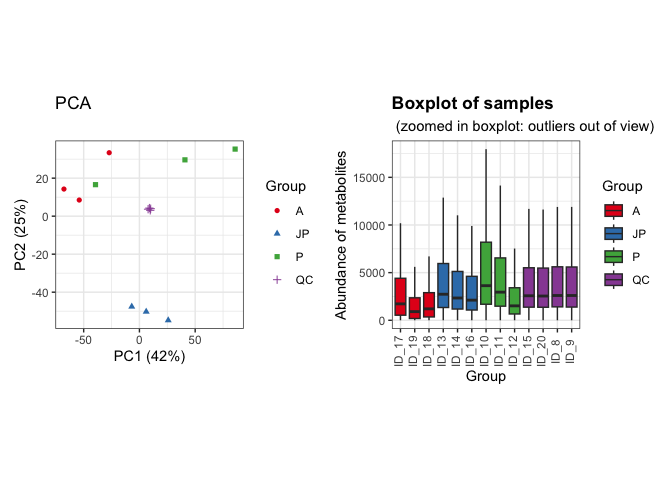
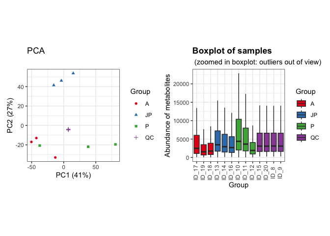
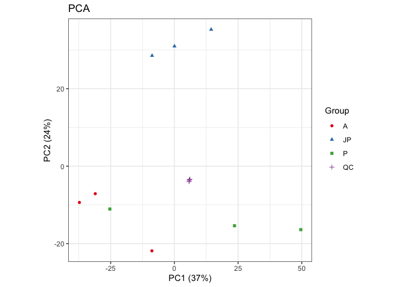
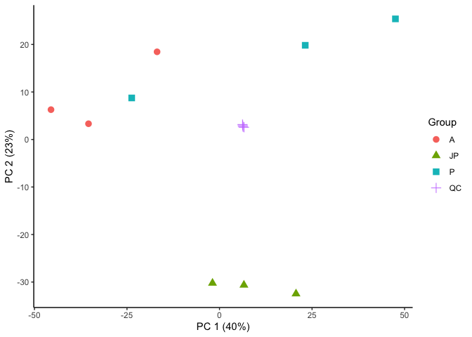
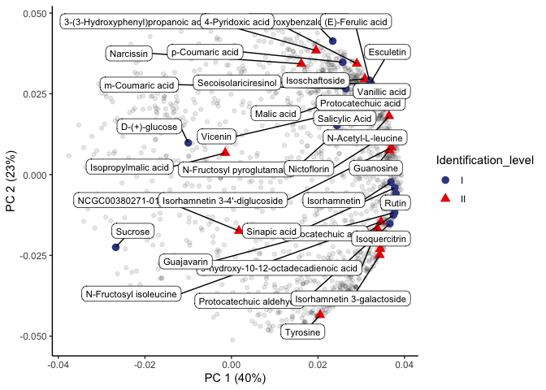
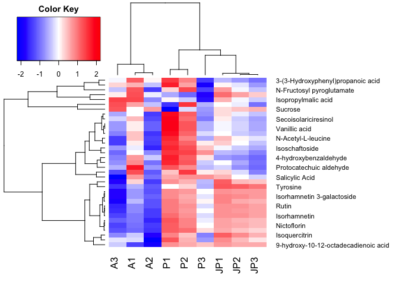

LC-MS of *U.saggitifolia* in negative ionization mode
================
Pablo Corella, Jefferson Pastuña
2023-06-12

- [Introduction](#introduction)
  - [Before to start](#before-to-start)
- [Notame workflow](#notame-workflow)
  - [Preprocessing](#preprocessing)
  - [Second PCA and loading plot](#second-pca-and-loading-plot)
  - [Heat map plot](#heat-map-plot)

# Introduction

The present document aims to record the procedure given for the
statistical analysis of secondary metabolites present in the different
growth stages of *Urospatha saggitifolia*. For each step a brief
explanation, the code and graphics obtained are included.

The workflow used is taken from the paper [“notame”: Workflow for
Non-Targeted LC–MS Metabolic
Profiling](https://doi.org/10.3390/metabo10040135). Which offers a wide
variety of functions to perform untargeted metabolic profile analysis.

## Before to start

The “notame” package accepts as input a feature table that can be
obtained through software such as MZMine, MS-Dial, among others.

In this case, the table was obtained with the help of both programs. The
data was processed in MZmine to obtain the ideal analysis parameters as
well as to confirm the presence of previously found positive controls
(known metabolites). Then, the obtained parameters were entered in
MS-Dial to generate a (\*.txt) file that was slightly modified to obtain
the feature table.

Modifications made to the raw (\*.txt) file can be summarized in adding
and renaming columns. The added columns “Column” and “Ion Mode” allow to
analyze samples with different types of columns and with different
ionization modes respectively. Also, the cells corresponding to mass and
retention time must be renamed so that the package can detect and
process it.

# Notame workflow

As a first step for the analysis, all the necessary libraries were
installed and loaded in Rstudio.

``` r
library(notame)
library(doParallel) 
library(magrittr)  
library(tidyverse) 
library(patchwork) 
library(dplyr)
library(here)
library(gplots)
```

Then, a log system was added to have a record of each process executed.

``` r
init_log(log_file = '../Result/LC-MS_Negative/log_LC-MS_Negative.txt')
```

    ## INFO [2023-10-31 15:30:41] Starting logging

Next, the feature list was imported using the read_from_excel function.

``` r
NEG_data <- read_from_excel(file = "../Data/NEG_feature_list.xlsx",
                            sheet = 1, corner_row = 4, 
                            corner_column = "D",
                            split_by = c("Column", "Ion mode"))
```

    ## INFO [2023-10-31 15:30:42] Corner detected correctly at row 4, column D
    ## INFO [2023-10-31 15:30:42] 
    ## Extracting sample information from rows 1 to 4 and columns E to Q
    ## INFO [2023-10-31 15:30:42] Replacing spaces in sample information column names with underscores (_)
    ## INFO [2023-10-31 15:30:42] Naming the last column of sample information "Datafile"
    ## INFO [2023-10-31 15:30:42] 
    ## Extracting feature information from rows 5 to 3942 and columns A to D
    ## INFO [2023-10-31 15:30:42] Creating Split column from Column, Ion mode
    ## INFO [2023-10-31 15:30:42] Feature_ID column not found, creating feature IDs
    ## INFO [2023-10-31 15:30:42] Identified m/z column Average Mz and retention time column Average Rt(min)
    ## INFO [2023-10-31 15:30:42] Creating feature IDs from Split, m/z and retention time
    ## INFO [2023-10-31 15:30:42] Replacing dots (.) in feature information column names with underscores (_)
    ## INFO [2023-10-31 15:30:42] 
    ## Extracting feature abundances from rows 5 to 3942 and columns E to Q
    ## INFO [2023-10-31 15:30:42] 
    ## Checking sample information
    ## INFO [2023-10-31 15:30:42] QC column generated from rows containing 'QC'
    ## INFO [2023-10-31 15:30:42] Sample ID autogenerated from injection orders and prefix ID_
    ## INFO [2023-10-31 15:30:42] Checking that feature abundances only contain numeric values
    ## INFO [2023-10-31 15:30:42] 
    ## Checking feature information
    ## INFO [2023-10-31 15:30:42] Checking that feature IDs are unique and not stored as numbers
    ## INFO [2023-10-31 15:30:42] Checking that m/z and retention time values are reasonable

Once the data was read, the next step was to create a MetaboSet in order
to create a specific R object.

``` r
NEG_modes <- construct_metabosets(exprs = NEG_data$exprs,
                                  pheno_data = NEG_data$pheno_data,
                                  feature_data = NEG_data$feature_data,
                                  group_col = "Group")
```

    ## Initializing the object(s) with unflagged features
    ## INFO [2023-10-31 15:30:42] 
    ## Checking feature information
    ## INFO [2023-10-31 15:30:42] Checking that feature IDs are unique and not stored as numbers
    ## INFO [2023-10-31 15:30:42] Checking that feature abundances only contain numeric values
    ## INFO [2023-10-31 15:30:42] Setting row and column names of exprs based on feature and pheno data

Finally, each mode was extracted in a single object.

``` r
NEG_mode <- NEG_modes$RP_NEG
```

As a additional step, we can visualize the raw data in order to inspect
the processing routines.

``` r
NEG_raw_sambx <- plot_sample_boxplots(NEG_mode, order_by = "Group")
NEG_raw_pca <- plot_pca(NEG_mode, center = T)
NEG_raw_pca + NEG_raw_sambx
```

<!-- -->

In the boxplot we can see how the abundance of metabolites present in
the QCs does not vary between them, so the drift correction could be
optional.

## Preprocessing

The first step of the preprocessing is to change the features with value
equal to 0 to NA.

``` r
NEG_mode <- mark_nas(NEG_mode, value = 0)
```

Then, features with low detection rate are first flagged and then will
be removed. The notame package employs two criteria to select this
features. First, is the feature presence in a percentage of QC
injections, and then the feature presence in a percentage within a
sample group or class.

``` r
NEG_mode <- flag_detection(NEG_mode, qc_limit = 0.75, group_limit = 0.8)
```

    ## INFO [2023-10-31 15:30:43] 
    ## 2% of features flagged for low detection rate

With these values, features which that were not detected in the 75% of
the QC injections and 80% of sample groups will be discarded.

The next steps for preprocessing correspond to drift correction. The
drift correction can be applied by smoothed cubic spline regression.

``` r
NEG_dc <- dc_cubic_spline(NEG_mode)
```

    ## INFO [2023-10-31 15:30:43] 
    ## Starting drift correction at 2023-10-31 15:30:43.089806
    ## INFO [2023-10-31 15:30:45] Drift correction performed at 2023-10-31 15:30:45.767808

``` r
NEG_corrected <- NEG_dc$object
NEG_corrected <- flag_quality(NEG_corrected)
```

    ## INFO [2023-10-31 15:30:45] 
    ## 16% of features flagged for low quality

Then we can visualize the correction for QCs.

``` r
NEG_corr_sambx <- plot_sample_boxplots(NEG_corrected, order_by = "Group")
NEG_corr_pca <- plot_pca(NEG_corrected, center = T) 
NEG_corr_pca + NEG_corr_sambx
```

<!-- -->

Finally, a step to consider in preprocessing is feature cleastering.
This step helps us reduce the number of features of the same molecule
that were split due to ionization problems or unexpected behavior.

``` r
NEG_clusteredQC <- cluster_features(NEG_corrected, rt_window = 1/60, 
                                    all_features = T,
                                    corr_thresh = 0.9, 
                                    d_thresh = 0.8)
NEG_compressedQC <- compress_clusters(NEG_clusteredQC)
```

Finally, we can plot the PCA.

``` r
NEG_PCA_2<-plot_pca(NEG_compressedQC)
NEG_PCA_2
```

<!-- -->

## Second PCA and loading plot

Droping flagged features.

``` r
NEG_no_flag <- drop_flagged(NEG_compressedQC)

# Extracting feature table (Expression data)
NEG_feature_table <- exprs(NEG_no_flag)

# Extracting Phenotipic data
NEG_pheno_data <- NEG_no_flag@phenoData@data
```

Preparing data and transposing feature table.

``` r
NEG_feat_table_pca <- t(NEG_feature_table)

#Changing NA to 0 
NEG_feat_table_pca[is.na(NEG_feat_table_pca)]=0

# Centering and Scaling features
NEG_pca_noQC <- prcomp(NEG_feat_table_pca, center = T, scale. = T)
```

Plotting PCA results.

``` r
NEG_scores <- NEG_pca_noQC$x %>%         # Get PC coordinates
  data.frame %>%                         # Convert to data frames
  mutate(Sample_ID = rownames(.)) %>%    # Create a new column with the sample names
  left_join(NEG_pheno_data)              # Adding metadata
  
ggplot(NEG_scores, aes(PC1, PC2, shape = Group, color = Group)) +
  geom_point(size = 3) +
  guides(x=guide_axis(title = "PC 1 (40%)"), y=guide_axis(title = "PC 2 (23%)")) +
  theme_classic()
```

<!-- -->

``` r
# Save plot
#ggsave('Result/LC-MS_Negative/LC_MS_Negative_Score_Plot.png', width = 5, height = 4, device='png', dpi="print")
```

Plotting loading results.

``` r
NEG_loadings <- NEG_pca_noQC$rotation %>%    # Extract loadings
  data.frame(Feature_name = rownames(.))     # New column with feat name
```

Creating an artificial table with Feature name and Compound column.

``` r
NEG_feat_name <- readxl::read_excel("../Data/NEG_Metabolites.xlsx", 1)

# Creating a new small table of the annotated compounds
NEG_compouds_all <- left_join(NEG_feat_name, NEG_loadings)

# Plotting results
ggplot(NEG_loadings, aes(PC1, PC2)) + 
  geom_point(alpha = 0.1) +
  theme_classic() + 
  geom_point(data = NEG_compouds_all, aes(shape = Identification_level, color = Identification_level), size = 3) +
  ggrepel::geom_label_repel(data = NEG_compouds_all, aes(label = Compound), max.overlaps = 40,
                               box.padding = 0.5, label.padding = 0.27, label.r = 0.3, cex = 3) +
  guides(x=guide_axis(title = "PC 1 (40%)"), y=guide_axis(title = "PC 2 (23%)")) +
  ggsci::scale_color_aaas()
```

<!-- -->

``` r
# Save plot
#ggsave('Result/LC-MS_Negative/LC_MS_Negative_Loadings_Plot.png', width = 15, height = 9, device='png', dpi="print")
```

## Heat map plot

Loaded of identified metabolites abundance from Excel file.

``` r
met_hetmap <- readxl::read_excel("../Data/NEG_Metabolites_Hetmap.xlsx", 3)
met_hetmap <- met_hetmap[order(met_hetmap$A1),]     # sorted by column
row.names(met_hetmap) <- met_hetmap$X               # Named rows
met_hetmap_m <- data.matrix(met_hetmap)             # DataFrame
met_hetmap_m1 <- met_hetmap_m[1:35,-1]              # Delete the old rows with name
```

Logarithmic scale.

``` r
log_met_hetmap_m1 <- log10(met_hetmap_m1)
y <- log_met_hetmap_m1
```

Plotting Heat map

``` r
# Package installation and library loading
#if (!requireNamespace("devtools", quietly = TRUE)) {
#  install.packages("devtools")
#}
#devtools::install_github("cran/gplots")
library(gplots)

#Clusters
hr <- hclust(as.dist(1 - cor(t(y), method = "pearson")), method = "complete")
hc <- hclust(as.dist(1 - cor(y, method = "spearman")), method = "complete")
mycol <-  colorpanel(75, "blue", "white", "red")

#Creación del mapa de calor
heatmap.2( y, Rowv = as.dendrogram(hr), Colv = as.dendrogram(hc), col = mycol, density.info = "none", trace = "none", dendrogram = "both", scale = "row", labRow = NULL, labCol = NULL, margins = c(4, 14), key = TRUE, keysize = 1.5, key.xlab = NA, key.ylab = NA)
```

<!-- -->

Save Heatmap plot.

``` r
png(filename ='../Result/LC-MS_Negative/LC_MS2_Neg_HeatMap.png', width = 14, height = 8.64, units = "in", pointsize = 12, res=300)
heatmap.2(y, Rowv = as.dendrogram(hr), Colv = as.dendrogram(hc), col = mycol, density.info = "none", trace = "none", dendrogram = "both", scale = "row", labRow = NULL, labCol = NULL, margins = c(4, 14), key = TRUE, keysize = 0.5, key.xlab = NA, key.ylab = NA)
dev.off() 
```

Finish a record.

``` r
finish_log()
```

    ## INFO [2023-10-31 15:34:27] Finished analysis. Tue Oct 31 15:34:27 2023
    ## Session info:
    ## 
    ## INFO [2023-10-31 15:34:27] R version 4.3.1 (2023-06-16)
    ## INFO [2023-10-31 15:34:27] Platform: aarch64-apple-darwin20 (64-bit)
    ## INFO [2023-10-31 15:34:27] Running under: macOS Ventura 13.6
    ## INFO [2023-10-31 15:34:27] 
    ## INFO [2023-10-31 15:34:27] Matrix products: default
    ## INFO [2023-10-31 15:34:27] BLAS:   /Library/Frameworks/R.framework/Versions/4.3-arm64/Resources/lib/libRblas.0.dylib 
    ## INFO [2023-10-31 15:34:27] LAPACK: /Library/Frameworks/R.framework/Versions/4.3-arm64/Resources/lib/libRlapack.dylib;  LAPACK version 3.11.0
    ## INFO [2023-10-31 15:34:27] 
    ## INFO [2023-10-31 15:34:27] locale:
    ## INFO [2023-10-31 15:34:27] [1] en_US.UTF-8/en_US.UTF-8/en_US.UTF-8/C/en_US.UTF-8/en_US.UTF-8
    ## INFO [2023-10-31 15:34:27] 
    ## INFO [2023-10-31 15:34:27] time zone: America/New_York
    ## INFO [2023-10-31 15:34:27] tzcode source: internal
    ## INFO [2023-10-31 15:34:27] 
    ## INFO [2023-10-31 15:34:27] attached base packages:
    ## INFO [2023-10-31 15:34:27] [1] parallel  stats     graphics  grDevices utils     datasets  methods  
    ## INFO [2023-10-31 15:34:27] [8] base     
    ## INFO [2023-10-31 15:34:27] 
    ## INFO [2023-10-31 15:34:27] other attached packages:
    ## INFO [2023-10-31 15:34:27]  [1] gplots_3.1.3        here_1.0.1          patchwork_1.1.3    
    ## INFO [2023-10-31 15:34:27]  [4] lubridate_1.9.2     forcats_1.0.0       stringr_1.5.0      
    ## INFO [2023-10-31 15:34:27]  [7] dplyr_1.1.3         purrr_1.0.2         readr_2.1.4        
    ## INFO [2023-10-31 15:34:27] [10] tidyr_1.3.0         tibble_3.2.1        tidyverse_2.0.0    
    ## INFO [2023-10-31 15:34:27] [13] doParallel_1.0.17   iterators_1.0.14    foreach_1.5.2      
    ## INFO [2023-10-31 15:34:27] [16] notame_0.2.1        magrittr_2.0.3      ggplot2_3.4.4      
    ## INFO [2023-10-31 15:34:27] [19] futile.logger_1.4.3 Biobase_2.60.0      BiocGenerics_0.46.0
    ## INFO [2023-10-31 15:34:27] 
    ## INFO [2023-10-31 15:34:27] loaded via a namespace (and not attached):
    ## INFO [2023-10-31 15:34:27]  [1] gtable_0.3.4         xfun_0.40            caTools_1.18.2      
    ## INFO [2023-10-31 15:34:27]  [4] ggrepel_0.9.3        tzdb_0.4.0           bitops_1.0-7        
    ## INFO [2023-10-31 15:34:27]  [7] vctrs_0.6.4          tools_4.3.1          generics_0.1.3      
    ## INFO [2023-10-31 15:34:27] [10] fansi_1.0.5          highr_0.10           pkgconfig_2.0.3     
    ## INFO [2023-10-31 15:34:27] [13] KernSmooth_2.23-22   RColorBrewer_1.1-3   readxl_1.4.3        
    ## INFO [2023-10-31 15:34:27] [16] lifecycle_1.0.3      compiler_4.3.1       farver_2.1.1        
    ## INFO [2023-10-31 15:34:27] [19] credentials_1.3.2    munsell_0.5.0        ggsci_3.0.0         
    ## INFO [2023-10-31 15:34:27] [22] codetools_0.2-19     htmltools_0.5.6.1    sys_3.4.2           
    ## INFO [2023-10-31 15:34:27] [25] usethis_2.2.2        yaml_2.3.7           pillar_1.9.0        
    ## INFO [2023-10-31 15:34:27] [28] openssl_2.1.0        pcaMethods_1.92.0    gtools_3.9.4        
    ## INFO [2023-10-31 15:34:27] [31] zip_2.3.0            tidyselect_1.2.0     digest_0.6.33       
    ## INFO [2023-10-31 15:34:27] [34] stringi_1.7.12       labeling_0.4.3       rprojroot_2.0.3     
    ## INFO [2023-10-31 15:34:27] [37] fastmap_1.1.1        grid_4.3.1           colorspace_2.1-0    
    ## INFO [2023-10-31 15:34:27] [40] cli_3.6.1            utf8_1.2.3           withr_2.5.1         
    ## INFO [2023-10-31 15:34:27] [43] scales_1.2.1         timechange_0.2.0     rmarkdown_2.23      
    ## INFO [2023-10-31 15:34:27] [46] lambda.r_1.2.4       igraph_1.5.1         cellranger_1.1.0    
    ## INFO [2023-10-31 15:34:27] [49] askpass_1.1          hms_1.1.3            openxlsx_4.2.5.2    
    ## INFO [2023-10-31 15:34:27] [52] evaluate_0.22        knitr_1.43           viridisLite_0.4.2   
    ## INFO [2023-10-31 15:34:27] [55] rlang_1.1.1          futile.options_1.0.1 Rcpp_1.0.11         
    ## INFO [2023-10-31 15:34:27] [58] gert_1.9.3           glue_1.6.2           formatR_1.14        
    ## INFO [2023-10-31 15:34:27] [61] rstudioapi_0.15.0    R6_2.5.1             fs_1.6.3
