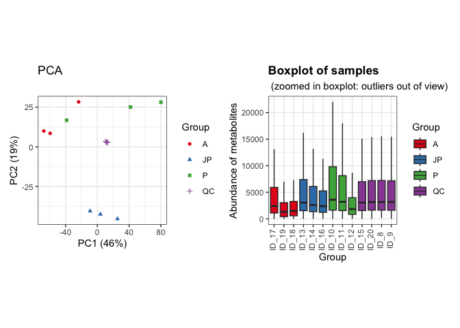
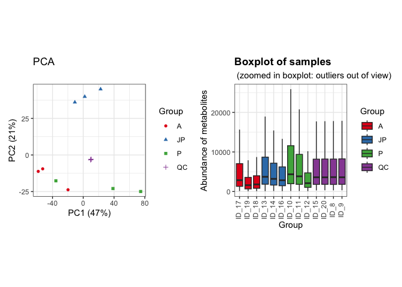
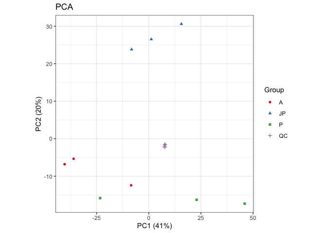
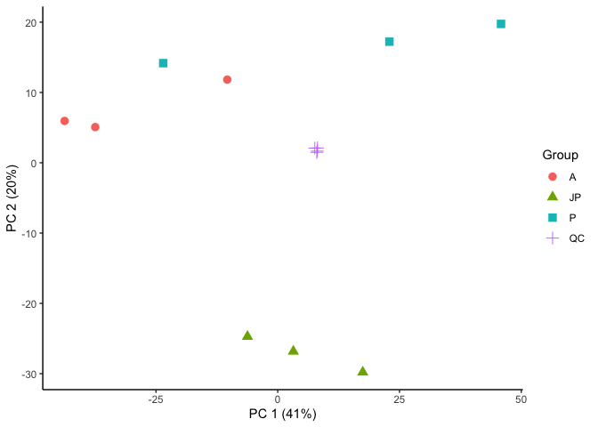
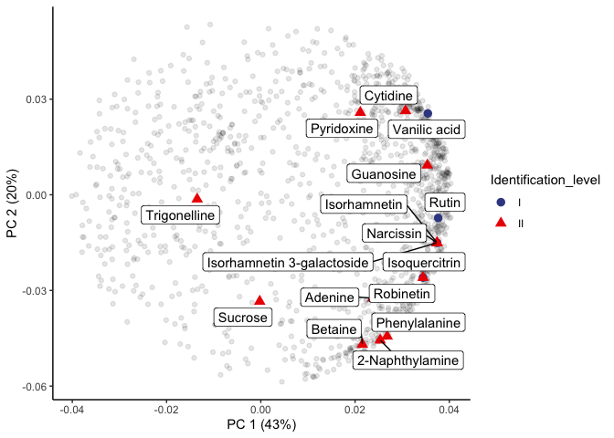
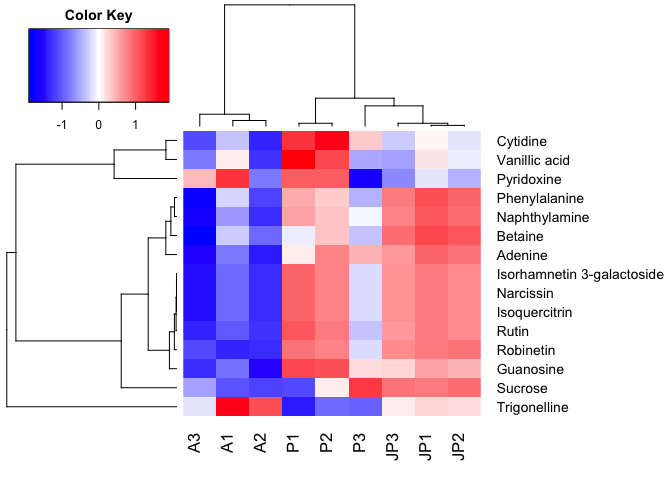

LC-MS of *U.saggitifolia* in positive ionization mode
================
Pablo Corella, Jefferson Pastuña
2023-06-11

- [Workspace](#workspace)
  - [Charging necesary libraries](#charging-necesary-libraries)
  - [Creating a record](#creating-a-record)
  - [Importing data](#importing-data)
  - [Creating metaboset objects](#creating-metaboset-objects)
  - [Extracting each mode in a single
    object](#extracting-each-mode-in-a-single-object)
  - [Plotting raw data](#plotting-raw-data)
- [Preprocessing](#preprocessing)
  - [Changing features with 0 to NA.](#changing-features-with-0-to-na)
  - [Flagging low detection rate
    features](#flagging-low-detection-rate-features)
  - [Drift correction](#drift-correction)
  - [Plotting corrected data](#plotting-corrected-data)
  - [Feature clustering](#feature-clustering)
  - [Plotting the notame PCA
    workflow](#plotting-the-notame-pca-workflow)
- [Second PCA and loading plot](#second-pca-and-loading-plot)
  - [Preparing data](#preparing-data)
  - [Plotting PCA results](#plotting-pca-results)
  - [Plotting loading results](#plotting-loading-results)
- [Heat map plot](#heat-map-plot)
  - [Plotting Heat map](#plotting-heat-map)
  - [Save Heatmap plot](#save-heatmap-plot)

# Workspace

## Charging necesary libraries

``` r
library(notame)  
library(doParallel) 
library(magrittr)  
library(tidyverse) 
library(patchwork) 
library(dplyr)
library(here)
library(gplots)
```

## Creating a record

``` r
init_log(log_file = '../Result/LC-MS_Positive/log_LC-MS_Positive.txt')
```

    ## INFO [2023-10-31 15:44:15] Starting logging

## Importing data

``` r
POS_data <- read_from_excel(file =  "../Data/POS_feature_list.xlsx", sheet = 1,
                            corner_row = 4, corner_column = "E",
                            split_by = c("Column", "Ion mode"))
```

    ## INFO [2023-10-31 15:44:15] Corner detected correctly at row 4, column E
    ## INFO [2023-10-31 15:44:15] 
    ## Extracting sample information from rows 1 to 4 and columns F to R
    ## INFO [2023-10-31 15:44:15] Replacing spaces in sample information column names with underscores (_)
    ## INFO [2023-10-31 15:44:15] Naming the last column of sample information "Datafile"
    ## INFO [2023-10-31 15:44:15] 
    ## Extracting feature information from rows 5 to 3550 and columns A to E
    ## INFO [2023-10-31 15:44:15] Creating Split column from Column, Ion mode
    ## INFO [2023-10-31 15:44:15] Feature_ID column not found, creating feature IDs
    ## INFO [2023-10-31 15:44:15] Identified m/z column Mass and retention time column RT
    ## INFO [2023-10-31 15:44:15] Creating feature IDs from Split, m/z and retention time
    ## INFO [2023-10-31 15:44:15] Replacing dots (.) in feature information column names with underscores (_)
    ## INFO [2023-10-31 15:44:15] 
    ## Extracting feature abundances from rows 5 to 3550 and columns F to R
    ## INFO [2023-10-31 15:44:15] 
    ## Checking sample information
    ## INFO [2023-10-31 15:44:15] QC column generated from rows containing 'QC'
    ## INFO [2023-10-31 15:44:15] Sample ID autogenerated from injection orders and prefix ID_
    ## INFO [2023-10-31 15:44:15] Checking that feature abundances only contain numeric values
    ## INFO [2023-10-31 15:44:15] 
    ## Checking feature information
    ## INFO [2023-10-31 15:44:15] Checking that feature IDs are unique and not stored as numbers
    ## INFO [2023-10-31 15:44:15] Checking that m/z and retention time values are reasonable

## Creating metaboset objects

``` r
POS_modes <- construct_metabosets(exprs = POS_data$exprs,
                                  pheno_data = POS_data$pheno_data,
                                  feature_data = POS_data$feature_data,
                                  group_col = "Group")
```

    ## Initializing the object(s) with unflagged features
    ## INFO [2023-10-31 15:44:15] 
    ## Checking feature information
    ## INFO [2023-10-31 15:44:15] Checking that feature IDs are unique and not stored as numbers
    ## INFO [2023-10-31 15:44:15] Checking that feature abundances only contain numeric values
    ## INFO [2023-10-31 15:44:15] Setting row and column names of exprs based on feature and pheno data

## Extracting each mode in a single object

``` r
POS_mode <- POS_modes$RP_POS
```

## Plotting raw data

``` r
POS_raw_sambx <- plot_sample_boxplots(POS_mode, order_by = "Group")
POS_raw_pca <- plot_pca(POS_mode, center = T)
POS_raw_pca + POS_raw_sambx
```

<!-- -->

# Preprocessing

## Changing features with 0 to NA.

``` r
POS_mode <- mark_nas(POS_mode, value = 0)
```

## Flagging low detection rate features

Features which that were not detected in the 75% of the QC injections
and 80% of sample groups will be flagged.

``` r
POS_mode <- flag_detection(POS_mode, qc_limit = 0.75, group_limit = 0.80)
```

    ## INFO [2023-10-31 15:44:16] 
    ## 0% of features flagged for low detection rate

## Drift correction

``` r
POS_dc <- dc_cubic_spline(POS_mode)
```

    ## INFO [2023-10-31 15:44:16] 
    ## Starting drift correction at 2023-10-31 15:44:16.464223
    ## INFO [2023-10-31 15:44:18] Drift correction performed at 2023-10-31 15:44:18.78392

``` r
POS_corrected <- POS_dc$object
POS_corrected <- flag_quality(POS_corrected)
```

    ## INFO [2023-10-31 15:44:18] 
    ## 17% of features flagged for low quality

## Plotting corrected data

``` r
POS_corr_sambx <- plot_sample_boxplots(POS_corrected, order_by = "Group")
POS_corr_pca <- plot_pca(POS_corrected, center = T) 
POS_corr_pca + POS_corr_sambx
```

<!-- -->

## Feature clustering

This step helps us reduce the number of features of the same molecule
that were split due to ionization problems or unexpected behavior.

``` r
POS_clusteredQC <- cluster_features(POS_corrected, 
                                    rt_window = 1/60, all_features = T, 
                                    corr_thresh = 0.9, d_thresh = 0.8 )
POS_compressedQC <- compress_clusters(POS_clusteredQC)
```

## Plotting the notame PCA workflow

``` r
POS_PCA_2<-plot_pca(POS_compressedQC)
POS_PCA_2
```

<!-- -->

# Second PCA and loading plot

``` r
# Extracting flagged features
POS_no_flag <- drop_flagged(POS_compressedQC)

# Extracting feature table (Expression data)
POS_feature_table <- exprs(POS_no_flag)

# Extracting Phenotipic data
POS_pheno_data <- POS_no_flag@phenoData@data
```

## Preparing data

``` r
# Transposing feature table 
POS_feat_table_pca <- t(POS_feature_table)

# Changing NA to 0 
POS_feat_table_pca[is.na(POS_feat_table_pca)]=0

# Centering and Scaling features
POS_pca_noQC <- prcomp(POS_feat_table_pca, center = T, scale. = T)
```

## Plotting PCA results

``` r
POS_scores <- POS_pca_noQC$x %>%         # Get PC coordinates
  data.frame %>%                         # Convert to data frames
  mutate(Sample_ID = rownames(.)) %>%    # Create a new column with the sample names
  left_join(POS_pheno_data)              # Adding metadata

ggplot(POS_scores, aes(PC1, PC2, shape = Group, color = Group)) +
  geom_point(size = 3) +
  guides(x=guide_axis(title = "PC 1 (41%)"), y=guide_axis(title = "PC 2 (20%)")) +
  theme_classic()
```

<!-- -->

``` r
# Save plot
#ggsave('Result/LC-MS_Positive/LC_MS_Positive_Score_Plot.png', width = 5, height = 4, device='png', dpi="print")
```

## Plotting loading results

``` r
POS_loadings <- POS_pca_noQC$rotation %>%   # Extract loadings
  data.frame(Feature_name = rownames(.))    # New column with feat name
```

Creating a table with Feature name and Compound column

``` r
POS_feat_name <- readxl::read_excel("../Data/POS_Metabolites.xlsx", 1)

# Creating a new small table of the annotated compounds
POS_compouds_all <- left_join(POS_feat_name, POS_loadings)

# Plotting results
ggplot(POS_loadings, aes(PC1, PC2)) + 
  geom_point(alpha = 0.1) +
  theme_classic() + 
  geom_point(data = POS_compouds_all, aes(shape = Identification_level, color = Identification_level), size = 3) +
  ggrepel::geom_label_repel(data = POS_compouds_all, aes(label = Compound),
                            box.padding = 0.3) +
  guides(x=guide_axis(title = "PC 1 (43%)"), y=guide_axis(title = "PC 2 (20%)")) +
  ggsci::scale_color_aaas()
```

<!-- -->

``` r
# Save plot
#ggsave('Result/LC-MS_Positive/LC_MS_Positive_Loadings_Plot.png', width = 15, height = 9, device='png', dpi="print")
```

# Heat map plot

Loaded of identified metabolites abundance from Excel file.

``` r
met_hetmap <- readxl::read_excel("../Data/POS_Metabolites_Hetmap.xlsx", 3)
met_hetmap <- met_hetmap[order(met_hetmap$A1),]     # sorted by column
row.names(met_hetmap) <- met_hetmap$X               # Named rows
met_hetmap_m <- data.matrix(met_hetmap)             # DataFrame
met_hetmap_m1 <- met_hetmap_m[1:15,-1]              # Delete the old rows with name
```

Logarithmic scale.

``` r
log_met_hetmap_m1 <- log10(met_hetmap_m1)
y <- log_met_hetmap_m1
```

## Plotting Heat map

``` r
# Package installation and library loading
#if (!requireNamespace("devtools", quietly = TRUE)) {
#  install.packages("devtools")
#}
#devtools::install_github("cran/gplots")
library(gplots)

# Clusters
hr <- hclust(as.dist(1 - cor(t(y), method = "pearson")), method = "complete")
hc <- hclust(as.dist(1 - cor(y, method = "spearman")), method = "complete")
mycol <-  colorpanel(75, "blue", "white", "red")

# Heat map
heatmap.2(y,  Rowv = as.dendrogram(hr),  Colv = as.dendrogram(hc),  col = mycol,  density.info = "none",  trace = "none",  dendrogram = "both",  scale = "row",  labRow = NULL,  labCol = NULL,  margins = c(4, 12),  key = TRUE,  keysize = 1.5,  key.xlab = NA,  key.ylab = NA,)
```

<!-- -->

## Save Heatmap plot

``` r
png(filename ="../Result/LC-MS_Positive/LC_MS2_Pos_HeatMap.png", width = 10, height = 6, units = "in", pointsize = 12, res=300)
heatmap.2(y, Rowv = as.dendrogram(hr), Colv = as.dendrogram(hc), col = mycol, density.info = "none", trace = "none", dendrogram = "both", scale = "row", labRow = NULL, labCol = NULL, margins = c(4, 12), key = TRUE, keysize = 0.7, key.xlab = NA, key.ylab = NA)
dev.off() 
```

Finish a record.

``` r
finish_log()
```

    ## INFO [2023-10-31 15:47:23] Finished analysis. Tue Oct 31 15:47:23 2023
    ## Session info:
    ## 
    ## INFO [2023-10-31 15:47:23] R version 4.3.1 (2023-06-16)
    ## INFO [2023-10-31 15:47:23] Platform: aarch64-apple-darwin20 (64-bit)
    ## INFO [2023-10-31 15:47:23] Running under: macOS Ventura 13.6
    ## INFO [2023-10-31 15:47:23] 
    ## INFO [2023-10-31 15:47:23] Matrix products: default
    ## INFO [2023-10-31 15:47:23] BLAS:   /Library/Frameworks/R.framework/Versions/4.3-arm64/Resources/lib/libRblas.0.dylib 
    ## INFO [2023-10-31 15:47:23] LAPACK: /Library/Frameworks/R.framework/Versions/4.3-arm64/Resources/lib/libRlapack.dylib;  LAPACK version 3.11.0
    ## INFO [2023-10-31 15:47:23] 
    ## INFO [2023-10-31 15:47:23] locale:
    ## INFO [2023-10-31 15:47:23] [1] en_US.UTF-8/en_US.UTF-8/en_US.UTF-8/C/en_US.UTF-8/en_US.UTF-8
    ## INFO [2023-10-31 15:47:23] 
    ## INFO [2023-10-31 15:47:23] time zone: America/New_York
    ## INFO [2023-10-31 15:47:23] tzcode source: internal
    ## INFO [2023-10-31 15:47:23] 
    ## INFO [2023-10-31 15:47:23] attached base packages:
    ## INFO [2023-10-31 15:47:23] [1] parallel  stats     graphics  grDevices utils     datasets  methods  
    ## INFO [2023-10-31 15:47:23] [8] base     
    ## INFO [2023-10-31 15:47:23] 
    ## INFO [2023-10-31 15:47:23] other attached packages:
    ## INFO [2023-10-31 15:47:23]  [1] gplots_3.1.3        here_1.0.1          patchwork_1.1.3    
    ## INFO [2023-10-31 15:47:23]  [4] lubridate_1.9.2     forcats_1.0.0       stringr_1.5.0      
    ## INFO [2023-10-31 15:47:23]  [7] dplyr_1.1.3         purrr_1.0.2         readr_2.1.4        
    ## INFO [2023-10-31 15:47:23] [10] tidyr_1.3.0         tibble_3.2.1        tidyverse_2.0.0    
    ## INFO [2023-10-31 15:47:23] [13] doParallel_1.0.17   iterators_1.0.14    foreach_1.5.2      
    ## INFO [2023-10-31 15:47:23] [16] notame_0.2.1        magrittr_2.0.3      ggplot2_3.4.4      
    ## INFO [2023-10-31 15:47:23] [19] futile.logger_1.4.3 Biobase_2.60.0      BiocGenerics_0.46.0
    ## INFO [2023-10-31 15:47:23] 
    ## INFO [2023-10-31 15:47:23] loaded via a namespace (and not attached):
    ## INFO [2023-10-31 15:47:23]  [1] gtable_0.3.4         xfun_0.40            caTools_1.18.2      
    ## INFO [2023-10-31 15:47:23]  [4] ggrepel_0.9.3        tzdb_0.4.0           bitops_1.0-7        
    ## INFO [2023-10-31 15:47:23]  [7] vctrs_0.6.4          tools_4.3.1          generics_0.1.3      
    ## INFO [2023-10-31 15:47:23] [10] fansi_1.0.5          highr_0.10           pkgconfig_2.0.3     
    ## INFO [2023-10-31 15:47:23] [13] KernSmooth_2.23-22   RColorBrewer_1.1-3   readxl_1.4.3        
    ## INFO [2023-10-31 15:47:23] [16] lifecycle_1.0.3      compiler_4.3.1       farver_2.1.1        
    ## INFO [2023-10-31 15:47:23] [19] credentials_1.3.2    munsell_0.5.0        ggsci_3.0.0         
    ## INFO [2023-10-31 15:47:23] [22] codetools_0.2-19     htmltools_0.5.6.1    sys_3.4.2           
    ## INFO [2023-10-31 15:47:23] [25] usethis_2.2.2        yaml_2.3.7           pillar_1.9.0        
    ## INFO [2023-10-31 15:47:23] [28] openssl_2.1.0        pcaMethods_1.92.0    gtools_3.9.4        
    ## INFO [2023-10-31 15:47:23] [31] zip_2.3.0            tidyselect_1.2.0     digest_0.6.33       
    ## INFO [2023-10-31 15:47:23] [34] stringi_1.7.12       labeling_0.4.3       rprojroot_2.0.3     
    ## INFO [2023-10-31 15:47:23] [37] fastmap_1.1.1        grid_4.3.1           colorspace_2.1-0    
    ## INFO [2023-10-31 15:47:23] [40] cli_3.6.1            utf8_1.2.3           withr_2.5.1         
    ## INFO [2023-10-31 15:47:23] [43] scales_1.2.1         timechange_0.2.0     rmarkdown_2.23      
    ## INFO [2023-10-31 15:47:23] [46] lambda.r_1.2.4       igraph_1.5.1         cellranger_1.1.0    
    ## INFO [2023-10-31 15:47:23] [49] askpass_1.1          hms_1.1.3            openxlsx_4.2.5.2    
    ## INFO [2023-10-31 15:47:23] [52] evaluate_0.22        knitr_1.43           viridisLite_0.4.2   
    ## INFO [2023-10-31 15:47:23] [55] rlang_1.1.1          futile.options_1.0.1 Rcpp_1.0.11         
    ## INFO [2023-10-31 15:47:23] [58] gert_1.9.3           glue_1.6.2           formatR_1.14        
    ## INFO [2023-10-31 15:47:23] [61] rstudioapi_0.15.0    R6_2.5.1             fs_1.6.3
