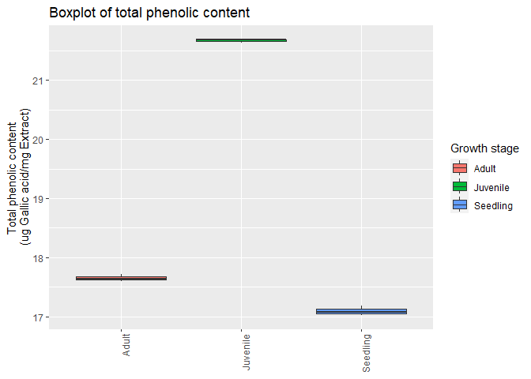
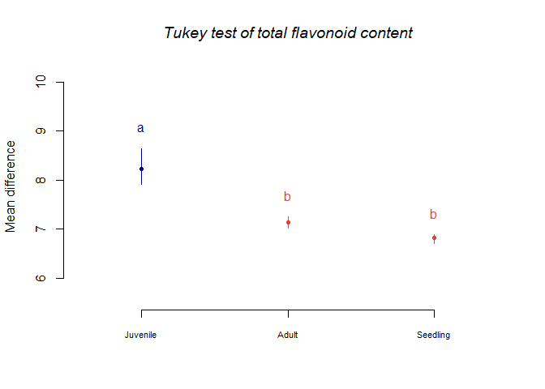

Total metabolites content of *U. sagitifolia*
================
Jefferson Pastuna
2023-12-20

- <a href="#objetive" id="toc-objetive">Objetive</a>
- <a href="#data-adquisition" id="toc-data-adquisition">Data
  adquisition</a>
  - <a href="#load-data" id="toc-load-data">Load data</a>
  - <a href="#boxplot" id="toc-boxplot">Boxplot</a>
  - <a href="#bartlett-test" id="toc-bartlett-test">Bartlett test</a>
  - <a href="#anova-test" id="toc-anova-test">ANOVA test</a>
  - <a href="#tukey-test" id="toc-tukey-test">Tukey test</a>

# Objetive

Description.

# Data adquisition

UV-vis data.

## Load data

Library:

``` r
# Loadding ggplot2 library
library(ggplot2)

# agricolae package installation and library loadding
#install.packages("agricolae", repos = "https://cran.r-project.org")
library(agricolae)

# ggbreak agricolae package installation and library loadding
remotes::install_github("YuLab-SMU/ggbreak")
library(ggbreak)
```

Working directiry.

``` r
ppath <- "F:/Jefferson-Pastuna/U_sagittifolia_tubers/"
```

Load data from Excel.

``` r
# To total phenolic content
t_phenolic <- data.frame(readxl::read_excel("F:/Jefferson-Pastuna/U_sagittifolia_tubers/Data/Total_Metabolite_Content.xlsx", 1))

# To total flavonoid content
t_flavonoid <- data.frame(readxl::read_excel("F:/Jefferson-Pastuna/U_sagittifolia_tubers/Data/Total_Metabolite_Content.xlsx", 2))
```

## Boxplot

Before AVOVA we can inspect the data.

``` r
# To total phenolic content
s_phe <- t_phenolic[c(1:3),1]
j_phe  <- t_phenolic[c(1:3),2]
a_phe <- t_phenolic[c(1:3),3]

# To total flavonoid content
s_fla <- t_flavonoid[c(1:3),1]
j_fla  <- t_flavonoid[c(1:3),2]
a_fla <- t_flavonoid[c(1:3),3]
```

Sample length.

``` r
n_sample  <- length(s_phe)
```

Data preparation to boxplot.

``` r
# To total phenolic content
cont_phe <- c(s_phe,j_phe,a_phe)
rep_phe <- c(rep("Seedling",n_sample),rep("Juvenile",n_sample),rep("Adult",n_sample))
datos_phe <- data.frame(rep_phe,cont_phe)

# To total flavonoid content
cont_flav <- c(s_fla,j_fla,a_fla)
rep_flav <- c(rep("Seedling",n_sample),rep("Juvenile",n_sample),rep("Adult",n_sample))
datos_flav <- data.frame(rep_flav,cont_flav)
```

Plotting boxplot.

``` r
# To total phenolic content
bx_phe <- ggplot(datos_phe,aes(x=rep_phe,y=cont_phe,fill=rep_phe)) +
  geom_boxplot() +
  ggtitle("Boxplot of total phenolic content") +
  guides(x=guide_axis(title = NULL),
         y=guide_axis(title = "Total phenolic content \n(mg Gallic acid/g Extract)"),
         fill=guide_legend(title="Growth stage")) +
  theme(axis.text.x=element_text(angle=90, hjust=1))

# To total flavonoid content
bx_flav <- ggplot(datos_flav,aes(x=rep_flav,y=cont_flav,fill=rep_flav)) +
  geom_boxplot() +
  ggtitle("Boxplot of total flavinoid content") +
  guides(x=guide_axis(title = NULL),
         y=guide_axis(title = "Total flavonoid content \n(mg Quercetin/g Extract)"),
         fill=guide_legend(title="Growth stage")) +
  theme(axis.text.x=element_text(angle=90, hjust=1))

bx_phe
```

<!-- -->

``` r
bx_flav
```

<!-- -->

## Bartlett test

Previus ANOVA test.

``` r
# To total phenolic content
bartlett.test(cont_phe~rep_phe,data = datos_phe)
```

    ## 
    ##  Bartlett test of homogeneity of variances
    ## 
    ## data:  cont_phe by rep_phe
    ## Bartlett's K-squared = 1.2298, df = 2, p-value = 0.5407

Because of p-value is 0.5407, and its mayor to 0.05, we accept (H0).
Therefore, samples have same varinces.

``` r
# To total flavonoid content
bartlett.test(cont_flav~rep_flav,data = datos_flav)
```

    ## 
    ##  Bartlett test of homogeneity of variances
    ## 
    ## data:  cont_flav by rep_flav
    ## Bartlett's K-squared = 3.1618, df = 2, p-value = 0.2058

Because of p-value is 0.2058, and its mayor to 0.05, we accept (H0).
Therefore, samples have same varinces.

## ANOVA test

ANOVA model.

``` r
# Logit model to total phenolic content
mylogit_phe <- glm(cont_phe~rep_phe,data = datos_phe)

# Logit model to total flavonoid content
mylogit_flav <- glm(cont_flav~rep_flav,data = datos_flav)
```

Print ANOVA test.

``` r
# To total phenolic content
anova(mylogit_phe,test="LRT")
```

    ## Analysis of Deviance Table
    ## 
    ## Model: gaussian, link: identity
    ## 
    ## Response: cont_phe
    ## 
    ## Terms added sequentially (first to last)
    ## 
    ## 
    ##         Df Deviance Resid. Df Resid. Dev  Pr(>Chi)    
    ## NULL                        8     37.358              
    ## rep_phe  2   37.336         6      0.023 < 2.2e-16 ***
    ## ---
    ## Signif. codes:  0 '***' 0.001 '**' 0.01 '*' 0.05 '.' 0.1 ' ' 1

``` r
# To total flavonoid content
anova(mylogit_flav,test="LRT")
```

    ## Analysis of Deviance Table
    ## 
    ## Model: gaussian, link: identity
    ## 
    ## Response: cont_flav
    ## 
    ## Terms added sequentially (first to last)
    ## 
    ## 
    ##          Df Deviance Resid. Df Resid. Dev  Pr(>Chi)    
    ## NULL                         8     3.5911              
    ## rep_flav  2   3.2587         6     0.3324 1.682e-13 ***
    ## ---
    ## Signif. codes:  0 '***' 0.001 '**' 0.01 '*' 0.05 '.' 0.1 ' ' 1

## Tukey test

``` r
# To total phenolic content
modelo_phe <- aov(cont_phe~rep_phe,data = datos_phe)
tukey_phe <- HSD.test(modelo_phe,"rep_phe", group=TRUE,console=TRUE)
```

    ## 
    ## Study: modelo_phe ~ "rep_phe"
    ## 
    ## HSD Test for cont_phe 
    ## 
    ## Mean Square Error:  0.003766667 
    ## 
    ## rep_phe,  means
    ## 
    ##          cont_phe        std r         se   Min   Max    Q25   Q50    Q75
    ## Adult    17.65333 0.06110101 3 0.03543382 17.60 17.72 17.620 17.64 17.680
    ## Juvenile 21.66667 0.03214550 3 0.03543382 21.63 21.69 21.655 21.68 21.685
    ## Seedling 17.09333 0.08082904 3 0.03543382 17.02 17.18 17.050 17.08 17.130
    ## 
    ## Alpha: 0.05 ; DF Error: 6 
    ## Critical Value of Studentized Range: 4.339195 
    ## 
    ## Minimun Significant Difference: 0.1537543 
    ## 
    ## Treatments with the same letter are not significantly different.
    ## 
    ##          cont_phe groups
    ## Juvenile 21.66667      a
    ## Adult    17.65333      b
    ## Seedling 17.09333      c

``` r
plot(tukey_phe, cex.names=0.7, ylab = "Media diferences", main="Tukey to total phenolic content", font.main=3)
```

<!-- -->

``` r
# To total flavonoid content
modelo_flav <- aov(cont_flav~rep_flav,data = datos_flav)
tukey_flav <- HSD.test(modelo_flav,"rep_flav", group=TRUE,console=TRUE)
```

    ## 
    ## Study: modelo_flav ~ "rep_flav"
    ## 
    ## HSD Test for cont_flav 
    ## 
    ## Mean Square Error:  0.055395 
    ## 
    ## rep_flav,  means
    ## 
    ##          cont_flav       std r       se   Min   Max    Q25   Q50   Q75
    ## Adult     7.141667 0.1185678 3 0.135886 7.015 7.250 7.0875 7.160 7.205
    ## Juvenile  8.233667 0.3736045 3 0.135886 7.905 8.640 8.0305 8.156 8.398
    ## Seedling  6.830333 0.1120104 3 0.135886 6.701 6.896 6.7975 6.894 6.895
    ## 
    ## Alpha: 0.05 ; DF Error: 6 
    ## Critical Value of Studentized Range: 4.339195 
    ## 
    ## Minimun Significant Difference: 0.5896358 
    ## 
    ## Treatments with the same letter are not significantly different.
    ## 
    ##          cont_flav groups
    ## Juvenile  8.233667      a
    ## Adult     7.141667      b
    ## Seedling  6.830333      b

``` r
plot(tukey_flav, cex.names=0.7, ylab = "Media diferences", main="Tukey to total flavonoid content", font.main=3)
```

<!-- -->
