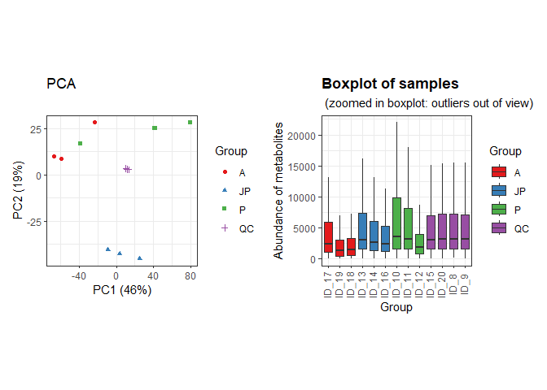
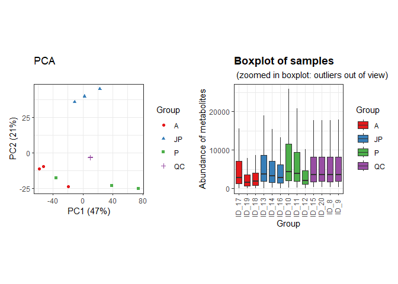
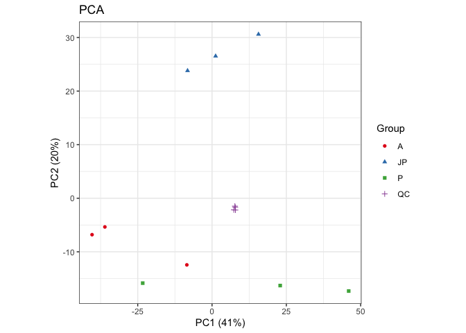
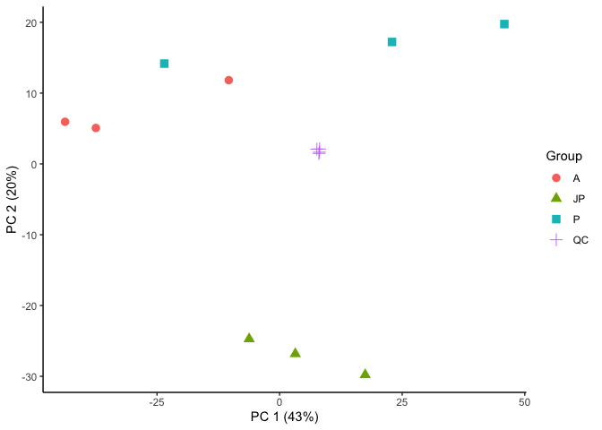
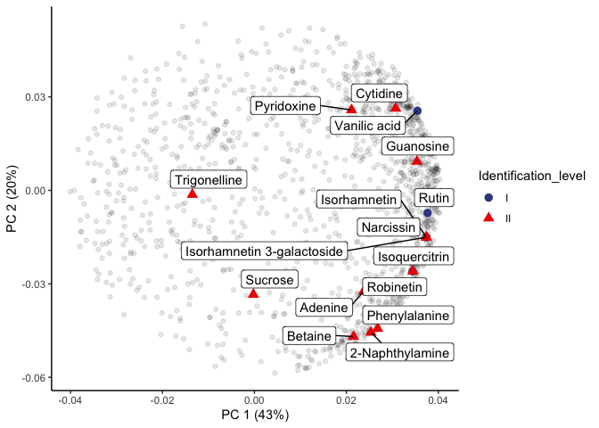
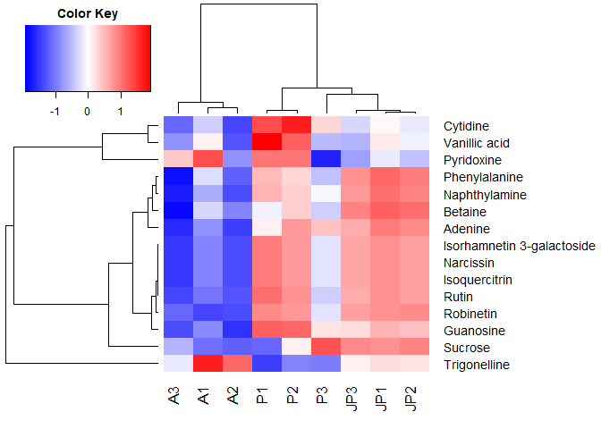

LC-MS of *U.saggitifolia* in positive ionization mode
================
Pablo Corella, Jefferson Pastuña
2023-06-11

- <a href="#workspace" id="toc-workspace">Workspace</a>
  - <a href="#charging-necesary-libraries"
    id="toc-charging-necesary-libraries">Charging necesary libraries</a>
  - <a href="#creating-a-record" id="toc-creating-a-record">Creating a
    record</a>
  - <a href="#importing-data" id="toc-importing-data">Importing data</a>
  - <a href="#creating-metaboset-objects"
    id="toc-creating-metaboset-objects">Creating metaboset objects</a>
  - <a href="#extracting-each-mode-in-a-single-object"
    id="toc-extracting-each-mode-in-a-single-object">Extracting each mode in
    a single object</a>
  - <a href="#plotting-raw-data" id="toc-plotting-raw-data">Plotting raw
    data</a>
- <a href="#preprocessing" id="toc-preprocessing">Preprocessing</a>
  - <a href="#changing-features-with-0-to-na"
    id="toc-changing-features-with-0-to-na">Changing features with 0 to
    NA.</a>
  - <a href="#flagging-low-detection-rate-features"
    id="toc-flagging-low-detection-rate-features">Flagging low detection
    rate features</a>
  - <a href="#drift-correction" id="toc-drift-correction">Drift
    correction</a>
  - <a href="#plotting-corrected-data"
    id="toc-plotting-corrected-data">Plotting corrected data</a>
  - <a href="#feature-clustering" id="toc-feature-clustering">Feature
    clustering</a>
  - <a href="#plotting-the-notame-pca-workflow"
    id="toc-plotting-the-notame-pca-workflow">Plotting the notame PCA
    workflow</a>
- <a href="#second-pca-and-loading-plot"
  id="toc-second-pca-and-loading-plot">Second PCA and loading plot</a>
  - <a href="#preparing-data" id="toc-preparing-data">Preparing data</a>
  - <a href="#plotting-pca-results" id="toc-plotting-pca-results">Plotting
    PCA results</a>
  - <a href="#plotting-loading-results"
    id="toc-plotting-loading-results">Plotting loading results</a>
- <a href="#heat-map-plot" id="toc-heat-map-plot">Heat map plot</a>
  - <a href="#plotting-heat-map" id="toc-plotting-heat-map">Plotting Heat
    map</a>
  - <a href="#save-heatmap-plot" id="toc-save-heatmap-plot">Save Heatmap
    plot</a>

# Workspace

## Charging necesary libraries

``` r
library(notame)  
library(doParallel) 
library(magrittr)  
library(tidyverse) 
library(patchwork) 
library(dplyr)
```

## Creating a record

``` r
ppath <- "C:/Users/F4ss0/Documents/Ikiam21062022/Tesis-Pablo-Corella/U_sagittifolia_tubers/"
init_log(log_file = paste0(ppath, 'Result/LC-MS_Positive/log_LC-MS_Positive.txt'))
```

    ## INFO [2023-06-27 04:42:35] Starting logging

## Importing data

``` r
POS_data <- read_from_excel(file = paste0(ppath, "Data/POS_feature_list.xlsx"), sheet = 1, corner_row = 4, corner_column = "E", split_by = c("Column", "Ion mode"))
```

    ## INFO [2023-06-27 04:42:38] Corner detected correctly at row 4, column E
    ## INFO [2023-06-27 04:42:38] 
    ## Extracting sample information from rows 1 to 4 and columns F to R
    ## INFO [2023-06-27 04:42:38] Replacing spaces in sample information column names with underscores (_)
    ## INFO [2023-06-27 04:42:38] Naming the last column of sample information "Datafile"
    ## INFO [2023-06-27 04:42:38] 
    ## Extracting feature information from rows 5 to 3550 and columns A to E
    ## INFO [2023-06-27 04:42:38] Creating Split column from Column, Ion mode
    ## INFO [2023-06-27 04:42:39] Feature_ID column not found, creating feature IDs
    ## INFO [2023-06-27 04:42:39] Identified m/z column Mass and retention time column RT
    ## INFO [2023-06-27 04:42:39] Creating feature IDs from Split, m/z and retention time
    ## INFO [2023-06-27 04:42:39] Replacing dots (.) in feature information column names with underscores (_)
    ## INFO [2023-06-27 04:42:39] 
    ## Extracting feature abundances from rows 5 to 3550 and columns F to R
    ## INFO [2023-06-27 04:42:39] 
    ## Checking sample information
    ## INFO [2023-06-27 04:42:39] QC column generated from rows containing 'QC'
    ## INFO [2023-06-27 04:42:39] Sample ID autogenerated from injection orders and prefix ID_
    ## INFO [2023-06-27 04:42:39] Checking that feature abundances only contain numeric values
    ## INFO [2023-06-27 04:42:40] 
    ## Checking feature information
    ## INFO [2023-06-27 04:42:40] Checking that feature IDs are unique and not stored as numbers
    ## INFO [2023-06-27 04:42:40] Checking that m/z and retention time values are reasonable

## Creating metaboset objects

``` r
POS_modes <- construct_metabosets(exprs = POS_data$exprs, pheno_data = POS_data$pheno_data, feature_data = POS_data$feature_data, group_col = "Group")
```

    ## Initializing the object(s) with unflagged features
    ## INFO [2023-06-27 04:42:40] 
    ## Checking feature information
    ## INFO [2023-06-27 04:42:40] Checking that feature IDs are unique and not stored as numbers
    ## INFO [2023-06-27 04:42:41] Checking that feature abundances only contain numeric values
    ## INFO [2023-06-27 04:42:41] Setting row and column names of exprs based on feature and pheno data

## Extracting each mode in a single object

``` r
POS_mode <- POS_modes$RP_POS
```

## Plotting raw data

``` r
POS_raw_sambx <- plot_sample_boxplots(POS_mode, order_by = "Group")
POS_raw_pca <- plot_pca(POS_mode, center = T)
POS_raw_pca + POS_raw_sambx
```

<!-- -->

# Preprocessing

## Changing features with 0 to NA.

``` r
POS_mode <- mark_nas(POS_mode, value = 0)
```

## Flagging low detection rate features

Features which that were not detected in the 75% of the QC injections
and 80% of sample groups will be flagged.

``` r
POS_mode <- flag_detection(POS_mode, qc_limit = 0.75, group_limit = 0.80)
```

    ## INFO [2023-06-27 04:42:50] 
    ## 0% of features flagged for low detection rate

## Drift correction

``` r
POS_dc <- dc_cubic_spline(POS_mode)
```

    ## INFO [2023-06-27 04:42:51] 
    ## Starting drift correction at 2023-06-27 04:42:51
    ## INFO [2023-06-27 04:43:25] Drift correction performed at 2023-06-27 04:43:25

``` r
POS_corrected <- POS_dc$object
POS_corrected <- flag_quality(POS_corrected)
```

    ## INFO [2023-06-27 04:43:26] 
    ## 17% of features flagged for low quality

## Plotting corrected data

``` r
POS_corr_sambx <- plot_sample_boxplots(POS_corrected, order_by = "Group")
POS_corr_pca <- plot_pca(POS_corrected, center = T) 
POS_corr_pca + POS_corr_sambx
```

<!-- -->

## Feature clustering

This step helps us reduce the number of features of the same molecule
that were split due to ionization problems or unexpected behavior.

``` r
POS_clusteredQC <- cluster_features(POS_corrected, rt_window = 1/60, all_features = T, corr_thresh = 0.9, d_thresh = 0.8 )
POS_compressedQC <- compress_clusters(POS_clusteredQC)
```

## Plotting the notame PCA workflow

``` r
POS_PCA_2<-plot_pca(POS_compressedQC)
POS_PCA_2
```

<!-- -->

# Second PCA and loading plot

``` r
# Extracting flagged features
POS_no_flag <- drop_flagged(POS_compressedQC)

# Extracting feature table (Expression data)
POS_feature_table <- exprs(POS_no_flag)

# Extracting Phenotipic data
POS_pheno_data <- POS_no_flag@phenoData@data
```

## Preparing data

``` r
# Transposing feature table 
POS_feat_table_pca <- t(POS_feature_table)

# Changing NA to 0 
POS_feat_table_pca[is.na(POS_feat_table_pca)]=0

# Centering and Scaling features
POS_pca_noQC <- prcomp(POS_feat_table_pca, center = T, scale. = T)
```

## Plotting PCA results

``` r
POS_scores <- POS_pca_noQC$x %>%         # Get PC coordinates
  data.frame %>%                         # Convert to data frames
  mutate(Sample_ID = rownames(.)) %>%    # Create a new column with the sample names
  left_join(POS_pheno_data)              # Adding metadata

ggplot(POS_scores, aes(PC1, PC2, shape = Group, color = Group)) +
  geom_point(size = 3) +
  guides(x=guide_axis(title = "PC 1 (43%)"), y=guide_axis(title = "PC 2 (20%)")) +
  theme_classic()
```

<!-- -->

``` r
# Save plot
#ggsave('Result/LC-MS_Positive/LC_MS_Positive_Score_Plot.png', width = 5, height = 4, device='png', dpi="print")
```

## Plotting loading results

``` r
POS_loadings <- POS_pca_noQC$rotation %>%   # Extract loadings
  data.frame(Feature_name = rownames(.))    # New column with feat name
```

Creating a table with Feature name and Compound column

``` r
POS_feat_name <- readxl::read_excel("POS_Metabolites.xlsx", 1)

# Creating a new small table of the annotated compounds
POS_compouds_all <- left_join(POS_feat_name, POS_loadings)

# Plotting results
ggplot(POS_loadings, aes(PC1, PC2)) + 
  geom_point(alpha = 0.1) +
  theme_classic() + 
  geom_point(data = POS_compouds_all, aes(shape = Identification_level, color = Identification_level), size = 3) +
  ggrepel::geom_label_repel(data = POS_compouds_all, aes(label = Compound),
                            box.padding = 0.3) +
  guides(x=guide_axis(title = "PC 1 (43%)"), y=guide_axis(title = "PC 2 (20%)")) +
  ggsci::scale_color_aaas()
```

<!-- -->

``` r
# Save plot
#ggsave('Result/LC-MS_Positive/LC_MS_Positive_Loadings_Plot.png', width = 15, height = 9, device='png', dpi="print")
```

# Heat map plot

Loaded of identified metabolites abundance from Excel file.

``` r
met_hetmap <- readxl::read_excel("POS_Metabolites_Hetmap.xlsx", 3)
met_hetmap <- met_hetmap[order(met_hetmap$A1),]     # sorted by column
row.names(met_hetmap) <- met_hetmap$X               # Named rows
met_hetmap_m <- data.matrix(met_hetmap)             # DataFrame
met_hetmap_m1 <- met_hetmap_m[1:15,-1]              # Delete the old rows with name
```

Logarithmic scale.

``` r
log_met_hetmap_m1 <- log10(met_hetmap_m1)
y <- log_met_hetmap_m1
```

## Plotting Heat map

``` r
# Package installation and library loading
#if (!requireNamespace("devtools", quietly = TRUE)) {
#  install.packages("devtools")
#}
#devtools::install_github("cran/gplots")
library(gplots)

# Clusters
hr <- hclust(as.dist(1 - cor(t(y), method = "pearson")), method = "complete")
hc <- hclust(as.dist(1 - cor(y, method = "spearman")), method = "complete")
mycol <-  colorpanel(75, "blue", "white", "red")

# Heat map
heatmap.2(y,  Rowv = as.dendrogram(hr),  Colv = as.dendrogram(hc),  col = mycol,  density.info = "none",  trace = "none",  dendrogram = "both",  scale = "row",  labRow = NULL,  labCol = NULL,  margins = c(4, 12),  key = TRUE,  keysize = 1.5,  key.xlab = NA,  key.ylab = NA,)
```

<!-- -->

## Save Heatmap plot

``` r
png(filename ="Result/LC-MS_Positive/LC_MS2_Pos_HeatMap.png", width = 10, height = 6, units = "in", pointsize = 12, res=300)
heatmap.2(y, Rowv = as.dendrogram(hr), Colv = as.dendrogram(hc), col = mycol, density.info = "none", trace = "none", dendrogram = "both", scale = "row", labRow = NULL, labCol = NULL, margins = c(4, 12), key = TRUE, keysize = 0.7, key.xlab = NA, key.ylab = NA)
dev.off() 
```

Finish a record.

``` r
finish_log()
```

    ## INFO [2023-06-27 05:30:11] Finished analysis. Tue Jun 27 05:30:11 2023
    ## Session info:
    ## 
    ## INFO [2023-06-27 05:30:11] R version 4.2.2 (2022-10-31 ucrt)
    ## INFO [2023-06-27 05:30:11] Platform: x86_64-w64-mingw32/x64 (64-bit)
    ## INFO [2023-06-27 05:30:11] Running under: Windows 10 x64 (build 19045)
    ## INFO [2023-06-27 05:30:11] 
    ## INFO [2023-06-27 05:30:11] Matrix products: default
    ## INFO [2023-06-27 05:30:11] 
    ## INFO [2023-06-27 05:30:11] locale:
    ## INFO [2023-06-27 05:30:11] [1] LC_COLLATE=Spanish_Spain.utf8  LC_CTYPE=Spanish_Spain.utf8   
    ## INFO [2023-06-27 05:30:11] [3] LC_MONETARY=Spanish_Spain.utf8 LC_NUMERIC=C                  
    ## INFO [2023-06-27 05:30:11] [5] LC_TIME=Spanish_Spain.utf8    
    ## INFO [2023-06-27 05:30:11] 
    ## INFO [2023-06-27 05:30:11] attached base packages:
    ## INFO [2023-06-27 05:30:11] [1] parallel  stats     graphics  grDevices utils     datasets  methods  
    ## INFO [2023-06-27 05:30:11] [8] base     
    ## INFO [2023-06-27 05:30:11] 
    ## INFO [2023-06-27 05:30:11] other attached packages:
    ## INFO [2023-06-27 05:30:11]  [1] gplots_3.1.3         patchwork_1.1.2.9000 lubridate_1.9.2     
    ## INFO [2023-06-27 05:30:11]  [4] forcats_1.0.0        stringr_1.5.0        dplyr_1.1.0         
    ## INFO [2023-06-27 05:30:11]  [7] purrr_1.0.1          readr_2.1.4          tidyr_1.3.0         
    ## INFO [2023-06-27 05:30:11] [10] tibble_3.1.8         tidyverse_2.0.0.9000 doParallel_1.0.14   
    ## INFO [2023-06-27 05:30:11] [13] iterators_1.0.14     foreach_1.5.2        notame_0.2.0        
    ## INFO [2023-06-27 05:30:11] [16] magrittr_2.0.3       ggplot2_3.4.1.9000   futile.logger_1.4.3 
    ## INFO [2023-06-27 05:30:11] [19] Biobase_2.58.0       BiocGenerics_0.44.0 
    ## INFO [2023-06-27 05:30:11] 
    ## INFO [2023-06-27 05:30:11] loaded via a namespace (and not attached):
    ## INFO [2023-06-27 05:30:11]  [1] ggrepel_0.9.2.9999   Rcpp_1.0.10          gert_1.9.2          
    ## INFO [2023-06-27 05:30:11]  [4] gtools_3.9.4         digest_0.6.31        utf8_1.2.3          
    ## INFO [2023-06-27 05:30:11]  [7] cellranger_1.1.0     R6_2.5.1             futile.options_1.0.1
    ## INFO [2023-06-27 05:30:11] [10] sys_3.4.1            evaluate_0.20        highr_0.10          
    ## INFO [2023-06-27 05:30:11] [13] pillar_1.8.1         rlang_1.0.6          readxl_1.4.2.9000   
    ## INFO [2023-06-27 05:30:11] [16] rstudioapi_0.14      rmarkdown_2.20       labeling_0.4.2      
    ## INFO [2023-06-27 05:30:11] [19] igraph_1.4.1.9002    munsell_0.5.0        compiler_4.2.2      
    ## INFO [2023-06-27 05:30:11] [22] xfun_0.37            pkgconfig_2.0.3      askpass_1.1         
    ## INFO [2023-06-27 05:30:11] [25] pcaMethods_1.90.0    htmltools_0.5.4      openssl_2.0.5       
    ## INFO [2023-06-27 05:30:11] [28] tidyselect_1.2.0     codetools_0.2-18     fansi_1.0.4         
    ## INFO [2023-06-27 05:30:11] [31] viridisLite_0.4.1    tzdb_0.3.0           withr_2.5.0         
    ## INFO [2023-06-27 05:30:11] [34] bitops_1.0-7         grid_4.2.2           gtable_0.3.1        
    ## INFO [2023-06-27 05:30:11] [37] lifecycle_1.0.3      formatR_1.14         credentials_1.3.2   
    ## INFO [2023-06-27 05:30:11] [40] scales_1.2.1         KernSmooth_2.23-20   zip_2.2.2           
    ## INFO [2023-06-27 05:30:11] [43] cli_3.6.0            stringi_1.7.12       farver_2.1.1        
    ## INFO [2023-06-27 05:30:11] [46] fs_1.6.1             ellipsis_0.3.2       generics_0.1.3      
    ## INFO [2023-06-27 05:30:11] [49] vctrs_0.5.2          openxlsx_4.2.5.2     ggsci_3.0.0         
    ## INFO [2023-06-27 05:30:11] [52] lambda.r_1.2.4       RColorBrewer_1.1-3   tools_4.2.2         
    ## INFO [2023-06-27 05:30:11] [55] glue_1.6.2           hms_1.1.2            fastmap_1.1.0       
    ## INFO [2023-06-27 05:30:11] [58] yaml_2.3.7           timechange_0.2.0     colorspace_2.1-0    
    ## INFO [2023-06-27 05:30:11] [61] caTools_1.18.2       knitr_1.42           usethis_2.1.6
