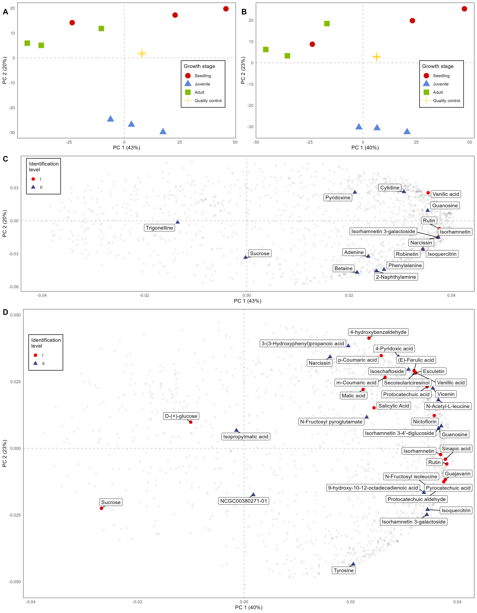
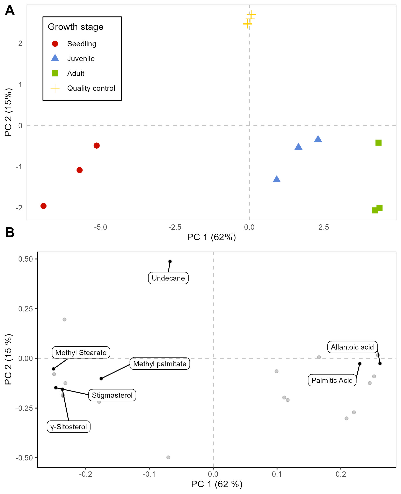

# About this repository

The present document aims to record the procedure given for the statistical analysis of secondary metabolites present in the different growth stages of *Urospatha saggitifolia*. For each step a brief explanation, the code and graphics obtained are included.

# Analysis Notebooks

-   [LC-MS Neg polarity](https://github.com/IKIAM-NPL/U_sagittifolia_tubers/blob/main/Neg_U_saggitifolia.md)
-   [LC-MS Pos polarity](https://github.com/IKIAM-NPL/U_sagittifolia_tubers/blob/main/Pos_U_saggitifolia.md)
-   [GC-EI-MS](https://github.com/IKIAM-NPL/U_sagittifolia_tubers/blob/main/EI_U_saggitifolia.md)

# Useful results

## PCA analysis

-   LC-(QTOF)

-   GC-(Q)MS

## Heatmaps and HCA

Heatmap of the annotated features in postive and negative polarity of the LC-MS/MS data.

