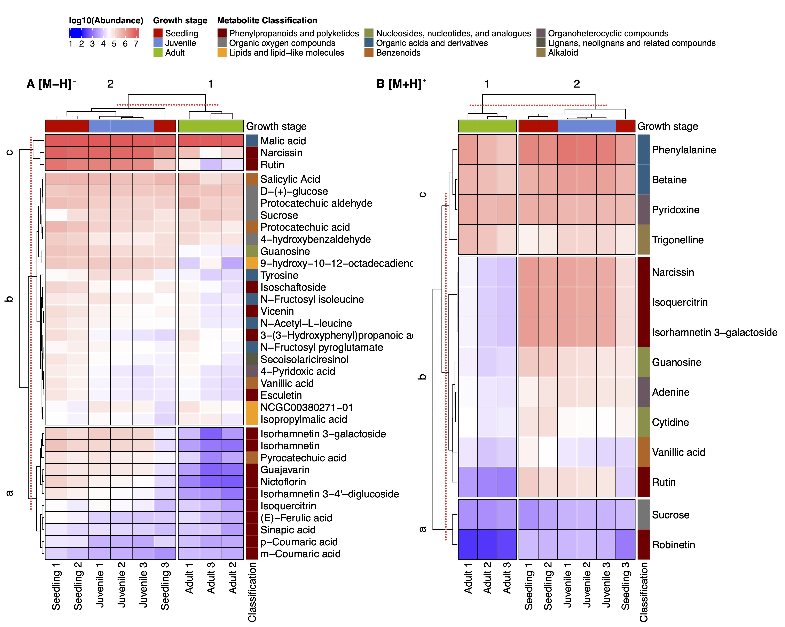

# About this repository

The present document aims to record the procedure given for the
statistical analysis of secondary metabolites present in the different
growth stages of *Urospatha saggitifolia*. For each step a brief
explanation, the code and graphics obtained are included.

# Analysis Notebooks

- [LC-MS Neg
  polarity](https://github.com/IKIAM-NPL/U_sagittifolia_tubers/blob/main/Notebooks/Neg_U_saggitifolia.md)
- [LC-MS Pos
  polarity](https://github.com/IKIAM-NPL/U_sagittifolia_tubers/blob/main/Notebooks/Pos_U_saggitifolia.md)
- [GC-EI-MS](https://github.com/IKIAM-NPL/U_sagittifolia_tubers/blob/main/Notebooks/EI_U_saggitifolia.md)

# Useful results

## PCA analysis

- LC-(QTOF)

<figure>

<figcaption aria-hidden="true">PCA analysis for positive (A and C) and
negative (B and D) polarity</figcaption>
</figure>

- GC-(Q)MS

<figure>

<figcaption aria-hidden="true">PCA analysis of the volatile
metabolome</figcaption>
</figure>

## Heatmaps and HCA

Heatmap of the annotated features in postive and negative polarity of
the LC-MS/MS data.

